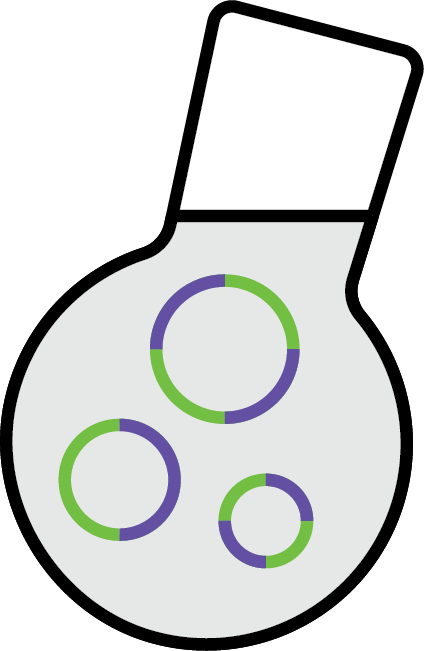

<a id="readme-top"></a>
<!--
*** Thanks for checking out the SLB_LipidMixer Readme. If you have a suggestion
*** that would make this better, please fork the repo and create a pull request
*** or simply open an issue with the tag "enhancement".
*** 
*** I imagine a world where scientific knowledge provides solutions for every health challenge, enabling everyone to live with autonomy, freedom, and well-being.
*** I created this project so that I might streamline taking raw microscopy data in my PhD and convert that in biological insights that might aid understanding the next generation of engineered T cell immunotherapies.
*** I hope this could be useful to a few future scienctist in whatever pursuit they are taking on. 
*** I would be overjoyed to help enable you to make discoveries and share knowlegde with humanity.
-->

<!-- PROJECT LOGO --> <br /> <div align="center">   <a href="https://github.com/kscrudders/SLB_LipidMixer">  </a> <h3 align="center">Fluorescence Spectra Simulation UI (SLB_LipidMixer)</h3> <p align="center"> Simplify calculating lipid mixture compositions <br /> <a href="https://github.com/your_username/SLB_LipidMixer"><strong>Explore the docs »</strong></a> <br /> <br /> <a href="https://github.com/kscrudders/SLB_LipidMixer/issues">Report Bug</a> · <a href="https://github.com/kscrudders/SLB_LipidMixer/issues">Request Feature</a> </p> </div> <!-- TABLE OF CONTENTS --> <details> <summary>Table of Contents</summary> <ol> <li><a href="#about-the-project">About The Project</a></li> <li><a href="#built-with">Built With</a></li> <li><a href="#getting-started">Getting Started</a> <ul> <li><a href="#prerequisites">Prerequisites</a></li> <li><a href="#installation">Installation</a></li> </ul> </li> <li><a href="#usage">Usage</a></li> <li><a href="#roadmap">Roadmap</a></li> <li><a href="#contributing">Contributing</a></li> <li><a href="#license">License</a></li> <li><a href="#contact">Contact</a></li> <li><a href="#acknowledgments">Acknowledgments</a></li> </ol> </details> <!-- ABOUT THE PROJECT -->
About The Project: </p>
SLB_LipidMixer simplifies the process of calculating lipid mixture compositions by:

- Calculating lipid masses and volumes from desired final volume and density of lipids.

Ideal for researchers working with lipid bilayers, liposomes, or membrane biophysics experiments using mol% lipid compositions.

<p align="right">(<a href="#readme-top">back to top</a>)</p> <!-- BUILT WITH -->

Built With Matlab and Matlab Toolboxs:
- MATLAB (tested on R2024b, should work on much older versions of Matlab)
	
<p align="right">(<a href="#readme-top">back to top</a>)</p> <!-- GETTING STARTED -->

Getting Started </p>
Follow these instructions to run SLB_LipidMixer on your local machine.

Prerequisites: </p>
Ensure you have the following installed:
- MATLAB
- Lipid properties CSV file (see provided example format)

Installation: </p>
* Clone the repository:
* sh
* Copy
* Edit
* git clone https://github.com/kscrudders/SLB_LipidMixer.git

Add to MATLAB path: </p>
* Open MATLAB.
* Go to Home > Set Path > Add Folder and select the cloned folder.

<p align="right">(<a href="#readme-top">back to top</a>)</p> <!-- USAGE EXAMPLES -->

Usage: </p>
* Open MATLAB and run:
   ```matlab
   SLB_LipidMixer.mlx
   ```
* Follow prompts to select lipids, set target molar fractions, and desired concentrations.
* Review output displayed in MATLAB command window.

<p align="right">(<a href="#readme-top">back to top</a>)</p> <!-- ROADMAP -->

## Roadmap

- [ ] Support optional calculation to use desired final molarity instead of mol% 


See the [open issues](https://github.com/kscrudders/SLB_LipidMixer/issues) for a full list of proposed features (and known issues).

<p align="right">(<a href="#readme-top">back to top</a>)</p> <!-- CONTRIBUTING -->

Contributing: </p>
Contributions make this script more robust and easier to use. If you have suggestions:
* Fork the Project
* Create your Feature Branch (git checkout -b feature/YourFeature)
* Commit your Changes (git commit -m 'Added an awesome feature')
* Push to the Branch (git push origin feature/YourFeature)
* Open a Pull Request

<p align="right">(<a href="#readme-top">back to top</a>)</p> <!-- LICENSE -->

License: </p>
This project is distributed under GNU Genereal Public License. </p>
See LICENSE.txt for details.

<p align="right">(<a href="#readme-top">back to top</a>)</p> <!-- CONTACT -->
Contact </p>
Kevin Scrudders – kscrudders@gmail.com

Project Link: https://github.com/kscrudders/SLB_LipidMixer

<p align="right">(<a href="#readme-top">back to top</a>)</p> <!-- ACKNOWLEDGMENTS -->

Acknowledgments
* The lab of Dr. Shalini T. Low-Nam
* The ever excellent MathWorks Documentation
* All code logic (chemistry dimentional analysis) was written by KLS. Using a data structure to accomodate variable lipid compositions was written by ChatGPT. 
* All code was approved and tested by Kevin.

<p align="right">(<a href="#readme-top">back to top</a>)</p>
